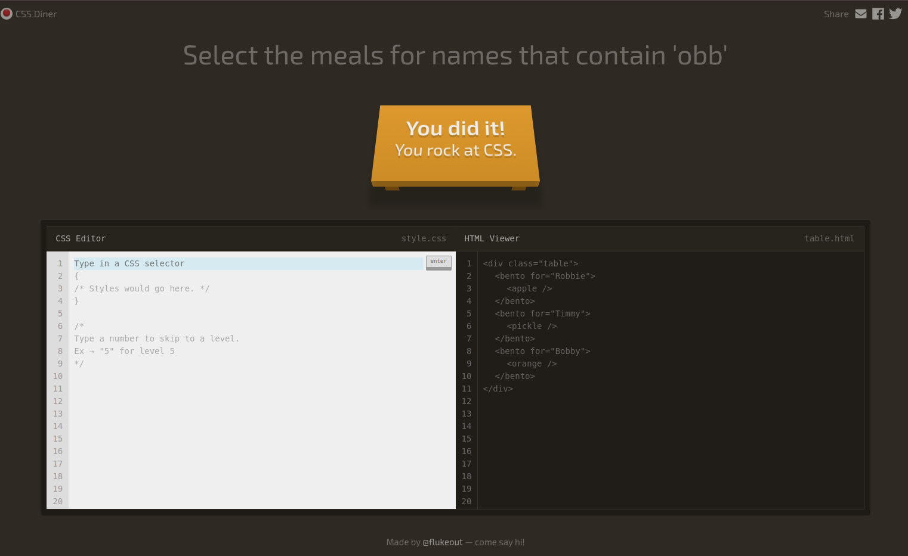

# CSS Diner: All Levels Completed 🥳

I’m excited to share that I’ve successfully completed all 32 levels of **CSS Diner**, a fun and interactive game to practice CSS selectors! 🎉

CSS Diner helps sharpen skills in:
- **Attribute Selectors**: `[attribute="value"]`, `[attribute*="value"]`
- **Combinators**: `>`, `+`, `~`
- **Pseudo-classes**: `:nth-child()`, `:last-child`
- And more advanced CSS concepts!

### 📝 What I Learned
- Mastery of CSS selectors for targeting specific elements.
- Understanding how selectors interact with the DOM.
- Confidence in applying advanced CSS for dynamic web styling.

### 🎯 Why It Matters
CSS selectors are fundamental for:
- Building responsive and interactive web designs.
- Writing clean and efficient CSS code.
- Targeting elements dynamically for JavaScript and frameworks.

---

### 🌟 Try CSS Diner Yourself!
If you're interested in practicing CSS selectors, check out [CSS Diner](https://flukeout.github.io/). It's a great way to improve your web development skills while having fun!

---

## Next Steps 🚀
- Applying these skills to real-world projects.
- Exploring more advanced CSS concepts like Grid and Flexbox.

